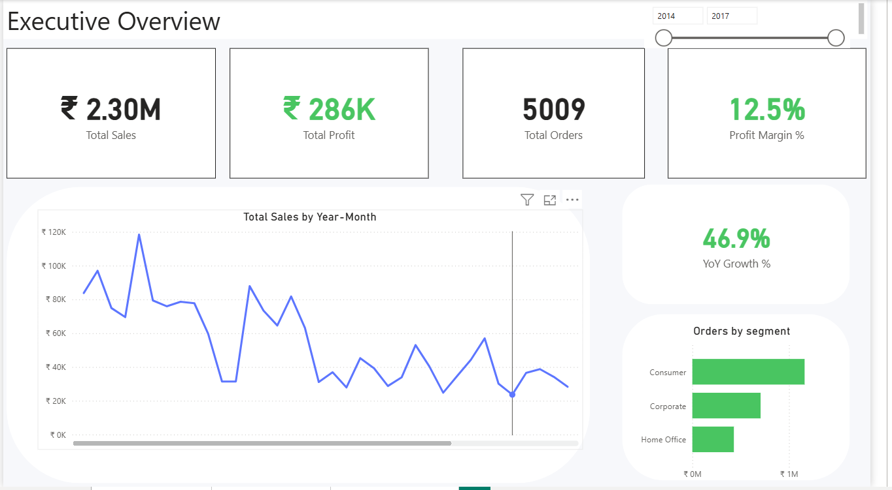

# Retail Business Intelligence Dashboard

End-to-End Retail Analytics Project using PostgreSQL and Power BI.
---

## 📊 Project Overview

This project presents a multi-page business intelligence solution analyzing retail sales, profitability, and customer behavior.

The dashboard is structured into three analytical views:

- Executive Overview
- Profitability Analysis
- Customer Intelligence

The goal of this project is to identify revenue concentration, profitability drivers, customer segmentation performance, and discount impact across product categories.
---

## 🛠 Tech Stack

- PostgreSQL – Data storage and querying
- SQL – Data transformation and modeling
- Power BI – Data visualization and dashboard design
- DAX – KPI calculations and analytical measures
---

## 📌 Key Business Insights

- Revenue is heavily concentrated in the Low Value customer segment (₹2.03M, ~88% of total revenue).
- Mid Value customers deliver the highest profitability (~24% margin).
- 19.5% of customers are loss-making, indicating pricing or discount inefficiencies.
- The High Value segment consists of 1 customer currently operating at a negative margin.
- Furniture category shows high discounting with comparatively weaker profit margins.
---

## 📂 Dashboard Structure

### 1️⃣ Executive Overview
Provides high-level KPIs including total sales, total profit, profit margin, and YoY growth trends.  
Includes monthly sales trends and segment distribution.

### 2️⃣ Profitability Analysis
Breaks down category and subcategory performance.  
Identifies highest and lowest margin contributors and segment-category combinations.

### 3️⃣ Customer Intelligence
Analyzes revenue concentration by customer segment.  
Highlights top profit-contributing customers and evaluates discount impact on margins.
---

## 📸 Dashboard Screenshots

### Executive Overview

### Profitability Analysis

### Customer Intelligence

